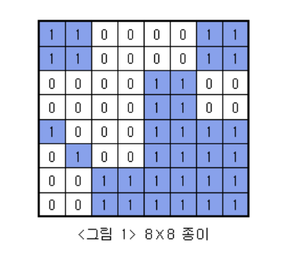

# 백준 색종이 만들기 - 2630

### 문제설명
- 그리디 알고리즘 과 같은 방법론 중 하나인 **분할정복** 문제.



- 위와 같은 좌표가 있고, 0은 white, 1은 blue 색상을 가진 색종이 이다. 
- N\*N(N = 2^k, 1<= k <=7, k 은 자연수)로 구성된 색종이
- 위에서 제시된 색종이를 잘라, 1개의 색상으로만 구성된 정사각형을 만들려고 한다.
- 이때 흰색 색종이와 청색 색종이의 갯수를 출력하라.
- 자세한건 사이트에서..
	https://www.acmicpc.net/problem/2630
	
### 문제풀이
- 분할정복은 문제를 하위문제(subproblem)으로 나누고 하위문제들에 대해 동일한 알고리즘을 적용하여 완전정복(완전풀이)를 하는 방법론이다.
- 위 문제에 적용하기 위해, 
	1) 문제를 분할하는 방법
	2) 문제를 정복(여기서는 완전탐색)하는 방법
	등 두가지 방법을 구현하여 알고리즘에 적용시킨다.
- 재귀적으로 작동하며, 작동 순서는
	1) 처음에 받은 색종이에 대해 완전탐색하여 1개의 색상으로 이뤄졌는지 판단한다.
		- 여기서 1개의 색상으로 이뤄졌다면 해당 색상에 대해 +1
		- 아니라면 해당 색종이를 4분할하여 부분문제로 분할한다.
	2) 색종이가 분할됐다면 4개의 색종이에 대해 재귀적으로 알고리즘이 작동하고,
	3) 아니라면 색상에 대해 카운트하고 return 한다.

### 풀이코드
```python
num_ = int(input())

youget = []

for i in range(num_):
    youget.append(input().split())

def makesub(lst0): ### 문제를 부분문제(subproblem)으로 분할하는 함수
    result = []
    n = len(lst0)
    for i in range(2):
        for j in [[0, (n // 2)], [n // 2, n]]:
            get_1 = []
            get_2 = []
            for k in lst0[j[0]:j[1]]:
                get_1.append(k[:n//2])
                get_2.append(k[n//2:])
            result.append(get_1)
            result.append(get_2)
    return result[0], result[1], result[2], result[3]

def find_(lst):   ### 제시된 색종이가 1가지 색상으로 이뤄졌는지 판단, 아니라면 
    check = True  ### 위 makesub 함수로 분할된 문제를 재귀적으로 다시 호출.
    start_ = lst[0][0]
    n = len(lst)
    for i in range(n):
        for j in range(n):
            if lst[i][j] != start_:
                check = False
                break
    if check:
        if start_ == "0":
            global white
            white += 1
        elif start_ == "1":
            global blue
            blue += 1

        return
    else:
        lst1,lst2,lst3,lst4 = makesub(lst)
        find_(lst1)
        find_(lst2)
        find_(lst3)
        find_(lst4)

white = 0
blue = 0
find_(youget)
print(white)
print(blue)
```

